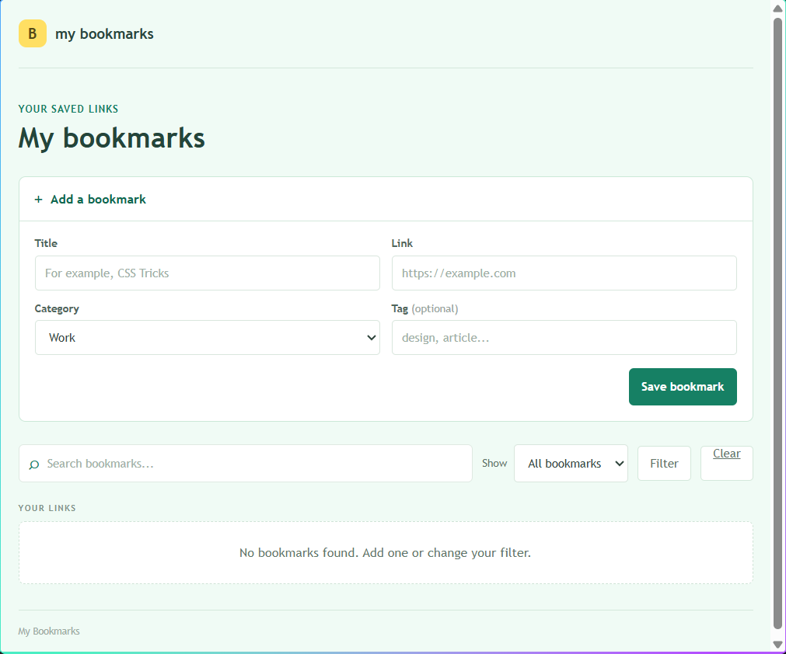
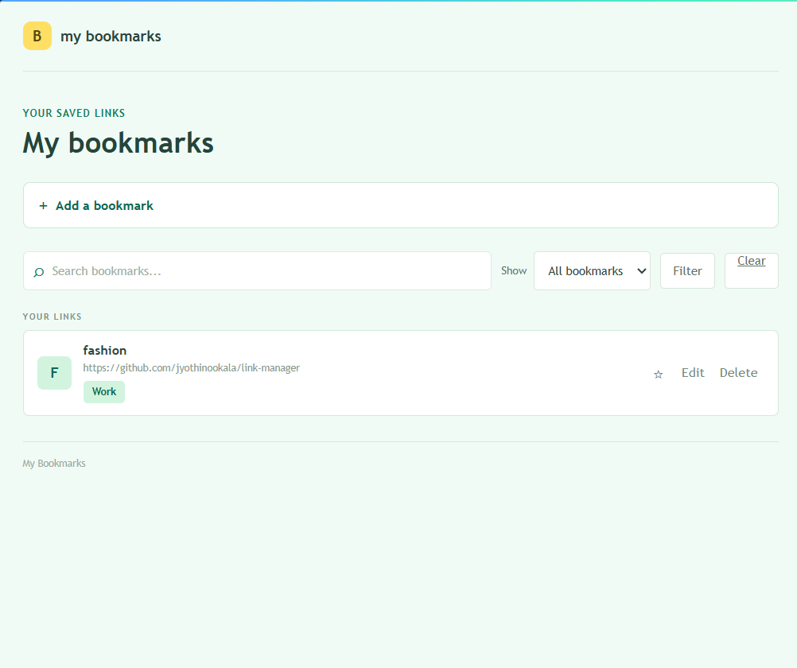

# My Bookmarks

A simple bookmark manager for saving and organizing useful links.

## Features

- Add, edit, and delete bookmarks
- Group links by category and tag
- Mark favorites
- Search and filter saved links

## Screenshots

### Initial page


### Add a bookmark



### Saved bookmark



## Built with

Java 17, Spring Boot, Spring MVC, Spring Data JPA, Thymeleaf, MySQL, HTML, and CSS.

## Run locally

Requirements: Java 17 or newer, Maven, and MySQL 8 or newer with a `bookmark_manager` database available.

From the project folder, run:

```powershell
mvn spring-boot:run
```

Open `http://localhost:8080` in your browser.
